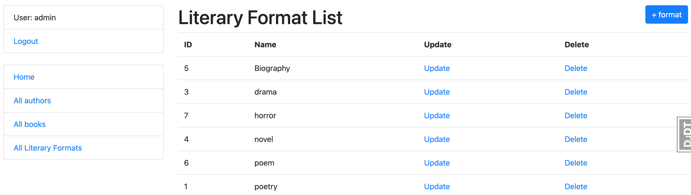

# library-my-mate

Django project for managing books and authors in Library

## Check it out!

[library_my_mate_deployed_to_Heroku](https://library-books-project.herokuapp.com/)

## Installation

Python3 must be already installed

'''shell
git clone https://github.com/AlenOl/library-my-mate
cd library-mate
python3 -m venv venv
source venv/bin/activate
pip install -r requirements.txt
python manage.py runserver # starts Django Server
'''

## Features

* Authentication functionality for Author/User
* Managing books authors & literary formats directly from website interface
* Powerful admin panel for advanced managing

## Demo

